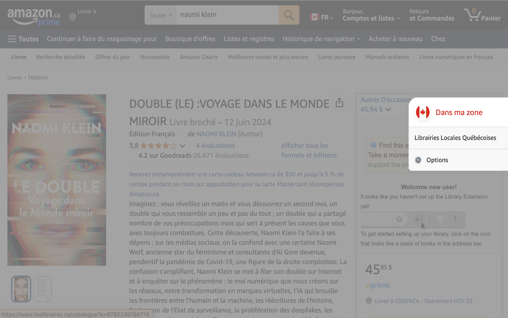

# DansMaZone / InMyZone


Une extension Chrome et Firefox qui vous permet de rediriger vos recherches Amazon.ca vers des librairies et commerces locaux canadiens.

Browser extension that suggests local Canadian alternatives to Amazon products by detecting categories and offering relevant local retailers.



## 🌟 Caractéristiques

- Ajoute une barre latérale sur les pages produit d'Amazon.ca
- Propose des alternatives locales canadiennes pour vos achats
- Détecte automatiquement la catégorie du produit et suggère des sites pertinents
- Prend en charge les recherches par ISBN pour les livres
- Entièrement bilingue (français/anglais)
- Interface utilisateur personnalisable pour ajouter vos sites préférés
- Éditeur de sites intégré avec validation d'URLs

## 📥 Installation

### Chrome Web Store
[Lien à venir]

### Firefox Add-ons
[Lien à venir]

### Installation manuelle (développeurs)

1. Clonez ce dépôt :
   ```bash
   git clone https://github.com/bolet777/DansMaZone.git
   ```

2. Installez les dépendances :
   ```bash
   npm install
   ```

3. Compilez l'extension :
   ```bash
   # Pour Chrome
   npm run build:chrome
   
   # Pour Firefox
   npm run build:firefox
   
   # Pour Edge
   npm run build:edge
   ```

## 🔧 Commandes de développement

### Build et développement
- `npm run build` : Compile pour tous les navigateurs
- `npm run build:chrome|firefox|edge` : Compile pour un navigateur spécifique
- `npm run dev` : Développement avec hot reload (Chrome)
- `npm run dev:chrome|firefox|edge` : Développement pour un navigateur spécifique

### Qualité du code
- `npm run lint` : Vérifie le style du code
- `npm run lint:fix` : Corrige automatiquement les erreurs de style
- `npm run format` : Vérifie le formatage
- `npm run format:fix` : Formate automatiquement le code
- `npm run check:fix` : Lance lint et format avec corrections

### Outils de développement
- `npm run edit-sites` : Lance l'éditeur de sites avec validation d'URLs
- `npm run edit-sites:dev` : Éditeur en mode développement avec auto-reload
- `npm run edit-sites:install` : Installe les dépendances de l'éditeur
- `npm run test` : Exécute les tests de classification
- `npm run extract-category-data` : Prépare les données pour les tests

## Installation des extensions

### Chrome
Ouvrez `chrome://extensions/`, activez le mode développeur, et cliquez sur "Charger l'extension non empaquetée". Sélectionnez le dossier `dist/chrome`.

### Firefox
Ouvrez `about:debugging#/runtime/this-firefox`, cliquez sur "Charger un module temporaire", puis sélectionnez le fichier `manifest.json` dans le dossier `dist/firefox`.

### Edge
Ouvrez `edge://extensions/`, activez le mode développeur, et cliquez sur "Charger l'extension non empaquetée". Sélectionnez le dossier `dist/edge`.

## 📁 Structure du projet

```
DansMaZone/
├── _locales/                 # Fichiers de traduction
│   ├── en/                   # Traductions anglaises
│   │   └── messages.json     # Messages en anglais
│   └── fr/                   # Traductions françaises
│       └── messages.json     # Messages en français
│
├── src/
│   ├── background/           # Script de fond de l'extension
│   │   └── background.js     # Gestion des événements en arrière-plan
│   │
│   ├── content_script/       # Script injecté dans les pages Amazon
│   │   └── index.js          # Code principal injecté dans Amazon
│   │
│   ├── datas/                # Données structurées pour l'extension
│   │   ├── category-classifier.js # Logique de classification et mots-clés
│   │   └── default-sites.json     # Sites web par catégorie
│   │
│   ├── datas-edit/           # Éditeur de sites intégré
│   │   ├── editSites.html    # Interface de l'éditeur
│   │   ├── editSites.js      # Logique de l'éditeur
│   │   ├── editSites.css     # Styles de l'éditeur
│   │   └── url-checker/      # Serveur de validation d'URLs
│   │       ├── server.js     # Serveur Express
│   │       ├── url-validator.js # Logique de validation
│   │       └── package.json  # Dépendances du serveur
│   │
│   ├── icons/                # Icônes de l'extension
│   │   ├── icon-16.png       # Icône 16×16
│   │   ├── icon-32.png       # Icône 32×32
│   │   ├── icon-48.png       # Icône 48×48
│   │   ├── icon-96.png       # Icône 96×96
│   │   └── icon-128.png      # Icône 128×128
│   │
│   ├── manifest/             # Configuration du manifest
│   │   └── index.js          # Générateur de manifest.json
│   │
│   ├── options/              # Page de préférences
│   │   ├── options.html      # Structure HTML de la page options
│   │   ├── options.css       # Styles pour la page options
│   │   └── options.js        # Logique JS pour la page options
│   │
│   └── styles/               # Feuilles de style
│       └── content_script.scss # Styles SCSS pour le contenu injecté
│
├── tests/                    # Tests automatisés
│   ├── mocks/                # Mocks pour les tests
│   ├── test-cases.json       # Cas de test
│   └── run-tests.js          # Exécuteur de tests
│
├── package.json              # Dépendances et scripts npm
├── webpack.config.js         # Configuration de build
├── biome.json                # Configuration du linter
└── TODO.md                   # Liste des améliorations prévues
```

## 🎨 Standards de code

- **Linter** : Biome (configuré dans biome.json)
- **Indentation** : 2 espaces
- **Longueur de ligne** : 100 caractères max
- **Chaînes** : Guillemets simples, template literals pour l'interpolation
- **Points-virgules** : Obligatoires
- **Variables** : Préférer `const` à `let/var`
- **Imports** : Bibliothèques externes d'abord, modules internes ensuite, styles en dernier
- **Nommage** : camelCase (variables, fonctions), PascalCase (classes)
- **Gestion d'erreurs** : Try/catch avec fonction centralisée `handleError`
- **Internationalisation** : API browser.i18n pour tous les textes utilisateur

## 🔧 Éditeur de sites intégré

L'extension inclut un éditeur web pour gérer les sites et valider les URLs :

### Démarrage
```bash
npm run edit-sites
```

### Fonctionnalités
- Interface web intuitive pour ajouter/modifier des sites
- Validation automatique des URLs avec tests HTTP réels
- Support du format bilingue (français/anglais)
- Export vers `default-sites.json`
- Gestion des catégories
- Tests par lot avec gestion de la concurrence

### Accès
Une fois démarré, ouvrez http://localhost:3000/editSites.html

## 🤝 Contribuer

Nous encourageons les contributions pour améliorer DansMaZone et ajouter plus de sites canadiens !

### Ajouter des sites

#### Option 1 : Via l'éditeur intégré (Recommandé)
1. Lancez l'éditeur : `npm run edit-sites`
2. Ouvrez http://localhost:3000/editSites.html
3. Ajoutez vos sites avec validation automatique
4. Exportez et soumettez une pull request

#### Option 2 : Via l'interface utilisateur
1. Ouvrez les préférences de l'extension
2. Ajoutez vos sites personnalisés
3. Exportez-les et envoyez-les par email à `info@dansmazone.ca`

#### Option 3 : Via GitHub
1. Modifiez le fichier `src/datas/default-sites.json`
2. Respectez le format bilingue requis
3. Soumettez une pull request

### Format des entrées de site

**Format bilingue actuel :**
```javascript
{
  "name": "Nom du Site",
  "urls": {
    "fr": "https://www.example.com/fr/search?q=##QUERY##",
    "en": "https://www.example.com/en/search?q=##QUERY##"
  }
}
```

**Variables disponibles :**
- `##QUERY##` : Terme de recherche général
- `##ISBN##` : ISBN pour les livres

### Gestion des catégories

Les catégories et mots-clés sont définis dans `src/datas/category-classifier.js` avec support bilingue :

```javascript
export const categoryKeywords = {
  'Catégorie': {
    fr: ['mot-clé1', 'mot-clé2'],
    en: ['keyword1', 'keyword2']
  }
};
```

## 🧪 Tests

### Exécution des tests
```bash
npm test
```

### Types de tests
- **Classification de produits** : Validation de l'algorithme TF-IDF
- **Préprocessing du texte** : Tests des fonctions de normalisation
- **Cas d'utilisation réels** : Basés sur des pages Amazon réelles

### Ajouter des cas de test
Modifiez `tests/test-cases.json` pour ajouter de nouveaux scénarios de test.

## 🌐 Multilingue

L'extension est entièrement bilingue (français/anglais) :

- **Détection automatique** de la langue selon la page Amazon.ca
- **Interface adaptative** selon les préférences du navigateur
- **Sites bilingues** avec URLs séparées pour chaque langue
- **Classification intelligente** avec mots-clés dans les deux langues

## 📈 Performance

L'extension est optimisée pour des performances élevées :

- **Cache TF-IDF** : Préparation des données une seule fois
- **Classification rapide** : Algorithme optimisé avec index inversé
- **Extraction légère** : Seulement les éléments DOM nécessaires
- **Gestion d'erreurs robuste** : Fallback gracieux en cas de problème

## 📝 Licence

Ce projet est sous licence [MIT](LICENSE.md).

## 🙏 Remerciements

- Tous les magasins et librairies canadiens qui offrent une alternative à Amazon
- Tous les contributeurs qui aident à enrichir cette extension
- La communauté open source pour les outils utilisés dans ce projet