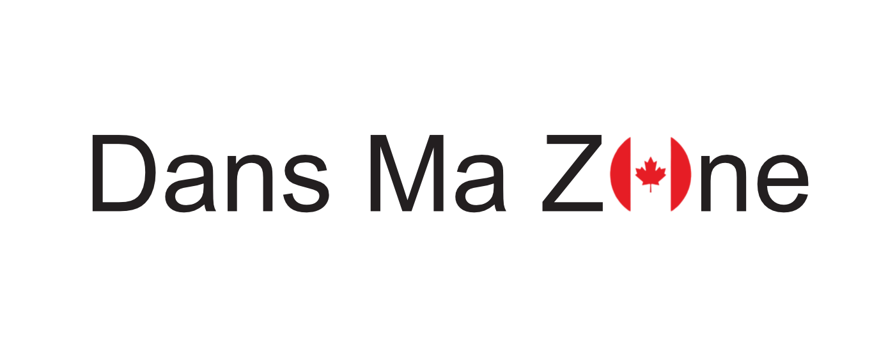

# DansMaZone / InMyZone



Une extension Chrome et Firefox qui vous permet de rediriger vos recherches Amazon.ca vers des librairies et commerces locaux canadiens.

Browser extension that suggests local Canadian alternatives to Amazon products by detecting categories and offering relevant local retailers.


## 🌟 Caractéristiques

- Ajoute une barre latérale sur les pages produit d'Amazon.ca
- Propose des alternatives locales canadiennes pour vos achats
- Détecte automatiquement la catégorie du produit et suggère des sites pertinents
- Prend en charge les recherches par ISBN pour les livres
- Entièrement bilingue (français/anglais)
- Interface utilisateur personnalisable pour ajouter vos sites préférés

## 📥 Installation

### Chrome Web Store
[Lien à venir]

### Firefox Add-ons
[Lien à venir]

### Installation manuelle (développeurs)

1. Clonez ce dépôt :
   ```bash
   git clone https://github.com/bolet777/DansMaZone.git
   ```

2. Installez les dépendances :
   ```bash
   npm install
   ```


3. Compilez l'extension :
   ```bash
   # Pour Chrome
   npm run build:chrome
   
   # Pour Firefox
   npm run build:firefox
   
   # Pour Edge
   npm run build:edge
   ```

## Build Commands
- Build: `npm run build` (all browsers) or `npm run build:chrome|firefox|edge`
- Development: `npm run dev` (Chrome) or `npm run dev:chrome|firefox|edge`
- Linting: `npm run lint` (check) or `npm run lint:fix` (auto-fix)
- Formatting: `npm run format` (check) or `npm run format:fix` (auto-fix)


## Chargez l'extension non empaquetée :
- Chrome : Ouvrez `chrome://extensions/`, activez le mode développeur, et cliquez sur "Charger l'extension non empaquetée". Sélectionnez le dossier `dist/chrome`.
- Firefox : Ouvrez `about:debugging#/runtime/this-firefox`, cliquez sur "Charger un module temporaire", puis sélectionnez le fichier `manifest.json` dans le dossier `dist/firefox`.
- Edge : Ouvrez `edge://extensions/`, activez le mode développeur, et cliquez sur "Charger l'extension non empaquetée". Sélectionnez le dossier `dist/edge`.

## 🔧 Développement

### Scripts disponibles

- `npm run dev:chrome` : Développement avec hot reload pour Chrome
- `npm run dev:firefox` : Développement avec hot reload pour Firefox
- `npm run dev:edge` : Développement avec hot reload pour Edge
- `npm run build` : Compile l'extension pour tous les navigateurs
- `npm run lint` : Vérifie le style du code
- `npm run format` : Formate le code

## Code Style
- Linter: Biome (configured in biome.json)
- Indentation: 2 spaces
- Line length: 100 chars max
- Strings: Single quotes, template literals for interpolation
- Semicolons: Required
- Variables: Prefer `const` over `let/var`
- Imports: External libs first, internal modules second, styles last
- Naming: camelCase (variables, functions), PascalCase (classes)
- Error handling: Try/catch with centralized `handleError` function
- Internationalization: Use browser.i18n API for all user-facing text

### Structure du projet

```
DansMaZone/
├── _locales/                 # Fichiers de traduction
│   ├── en/                   # Traductions anglaises
│   │   └── messages.json     # Messages en anglais
│   └── fr/                   # Traductions françaises
│       └── messages.json     # Messages en français
│
├── background/               # Script de fond de l'extension
│   └── background.js         # Gestion des événements en arrière-plan
│
├── content_script/           # Script injecté dans les pages Amazon
│   └── index.js              # Code principal injecté dans Amazon
│
├── datas/                    # Données structurées pour l'extension
│   ├── category-classifier.js # Logique de classification et mots-clés
│   └── category-sites.js     # Sites web par catégorie
│
├── icons/                    # Icônes de l'extension
│   ├── icon-16.png           # Icône 16×16
│   ├── icon-32.png           # Icône 32×32
│   ├── icon-48.png           # Icône 48×48
│   ├── icon-96.png           # Icône 96×96
│   └── icon-128.png          # Icône 128×128
│
├── manifest/                 # Configuration du manifest
│   └── index.js              # Générateur de manifest.json
│
├── options/                  # Page de préférences
│   ├── options.html          # Structure HTML de la page options
│   ├── options.css           # Styles pour la page options
│   └── options.js            # Logique JS pour la page options
│
├── styles/                   # Feuilles de style
│   └── content_script.scss   # Styles SCSS pour le contenu injecté
│
├── package.json              # Dépendances et scripts npm
└── webpack.config.js         # Configuration de build
```

### TODO pour mes ami.e.s développeurs !

Voir le fichier [TODO](TODO.md)

## 🤝 Contribuer

Nous encourageons les contributions pour améliorer DansMaZone et ajouter plus de sites canadiens !

### Ajouter des sites

Vous pouvez ajouter de nouveaux sites de deux façons :

1. **Via l'interface utilisateur** :
   - Ouvrez les préférences de l'extension
   - Ajoutez vos sites personnalisés
   - Exportez-les et envoyez-les par email à `info@dansmazone.ca`

2. **Via GitHub** :
   - Modifiez le fichier `src/datas/category-sites.js`
   - Ajoutez votre site dans la catégorie appropriée
   - Soumettez une pull request

### Format des entrées de site

```javascript
{
  name: 'Nom du Site',
  url: 'https://www.example.com/search?q=##QUERY##'
}
```

Utilisez `##QUERY##` pour indiquer où le terme de recherche sera inséré, 
(ou) Utilisez `##ISBN##` pour les recherches de livres par ISBN.

## 🌐 Multilingue

L'extension est disponible en français et en anglais et adapte automatiquement son interface selon la langue de votre navigateur ou de la page Amazon.ca visitée.

## 📝 Licence

Ce projet est sous licence [MIT](LICENSE.md).

## 🙏 Remerciements

- Tous les magasins et librairies canadiens qui offrent une alternative à Amazon
- Tous les contributeurs qui aident à enrichir cette extension